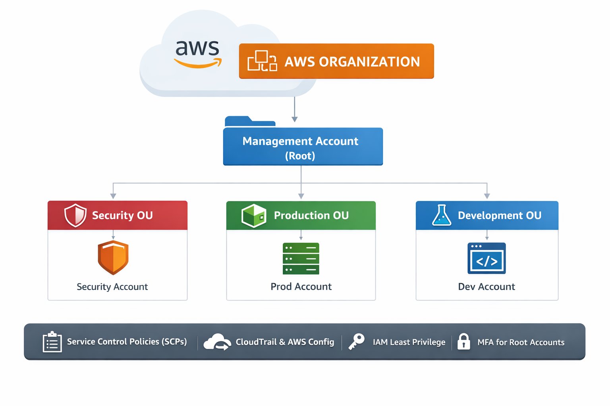

# 🏢 AWS Multi-Account Architecture with AWS Organizations
### Secure Landing Zone Implementation

---

## 📌 Descripción del Proyecto

Este proyecto demuestra cómo diseñar e implementar una arquitectura multi-cuenta en AWS utilizando **AWS Organizations**, permitiendo gobernanza centralizada, aislamiento de entornos y aplicación de políticas de seguridad a nivel organizacional.

---

## 🎯 Objetivos

- Crear una organización centralizada en AWS
- Implementar Organizational Units (OUs)
- Aplicar Service Control Policies (SCPs)
- Separar entornos (Producción, Desarrollo, Seguridad)
- Mejorar gobernanza y postura de seguridad

---

## 🏗️ Arquitectura




## 🧩 Paso 1 – Habilitar AWS Organizations

1. Ingresar a la cuenta principal (**Management Account**).
2. Ir a **AWS Organizations**.
3. Click en **Create organization**.
4. Seleccionar:
   - **All features (recomendado)**.

Esta cuenta se convierte en la cuenta de administración de la organización.

---

## 🧩 Paso 2 – Crear Organizational Units (OUs)

En **AWS Organizations**:

1. Ir a **Organizational Units**.
2. Crear las siguientes OUs:

- Security
- Production
- Development

---

## 🧩 Paso 3 – Crear o Invitar Cuentas

Puedes:

- Crear nuevas cuentas desde la organización.
- Invitar cuentas AWS existentes.

Ubicar cada cuenta dentro de su OU correspondiente:

- Security Account → Security OU  
- Production Account → Production OU  
- Development Account → Development OU  

---

## 🧩 Paso 4 – Habilitar y Crear Service Control Policies (SCPs)

1. Ir a **Policies**.
2. Habilitar **Service Control Policies**.
3. Crear una nueva política.

### Ejemplo: Bloquear regiones específicas

```json
{
  "Version": "2012-10-17",
  "Statement": [
    {
      "Sid": "DenyAsiaRegions",
      "Effect": "Deny",
      "Action": "*",
      "Resource": "*",
      "Condition": {
        "StringEquals": {
          "aws:RequestedRegion": [
            "ap-east-1",
            "ap-south-1"
          ]
        }
      }
    }
  ]
}
Adjuntar la política a la OU correspondiente.

## 🧩 Paso 5 – Buenas Prácticas de Seguridad

- Habilitar CloudTrail a nivel organización.
- Centralizar logs en la cuenta Security.
- Habilitar AWS Config.
- Aplicar principio de mínimo privilegio en IAM.
- Activar MFA en cuentas root.
